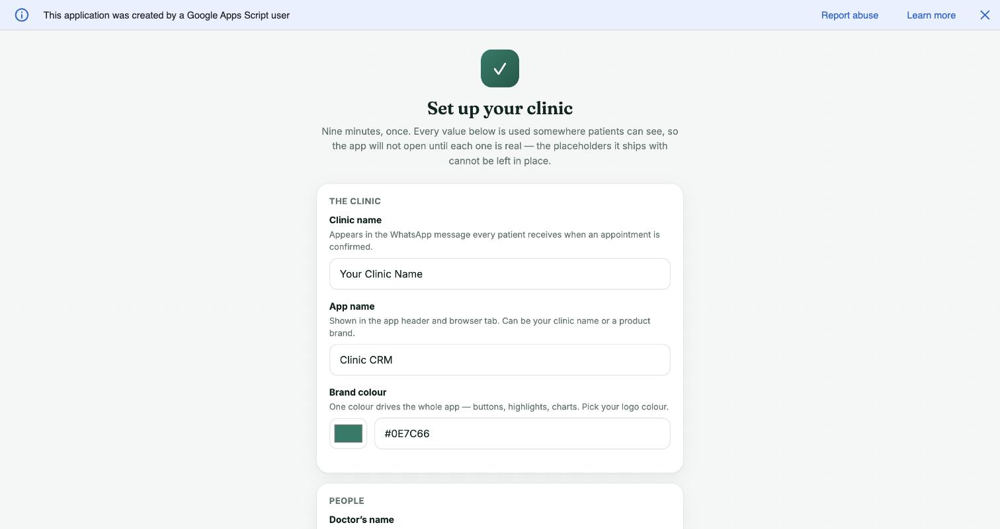
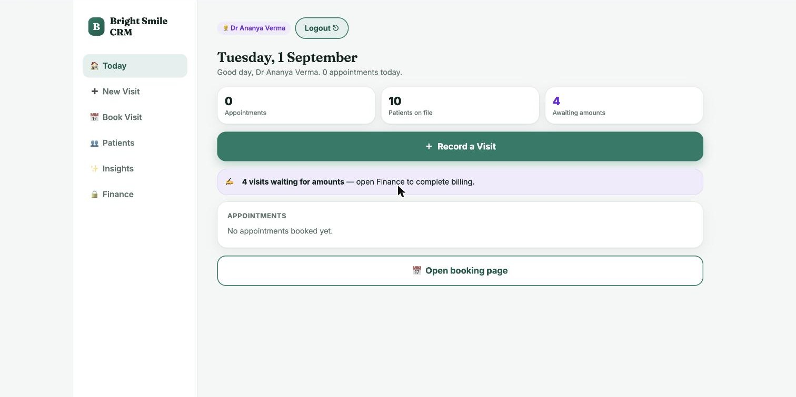
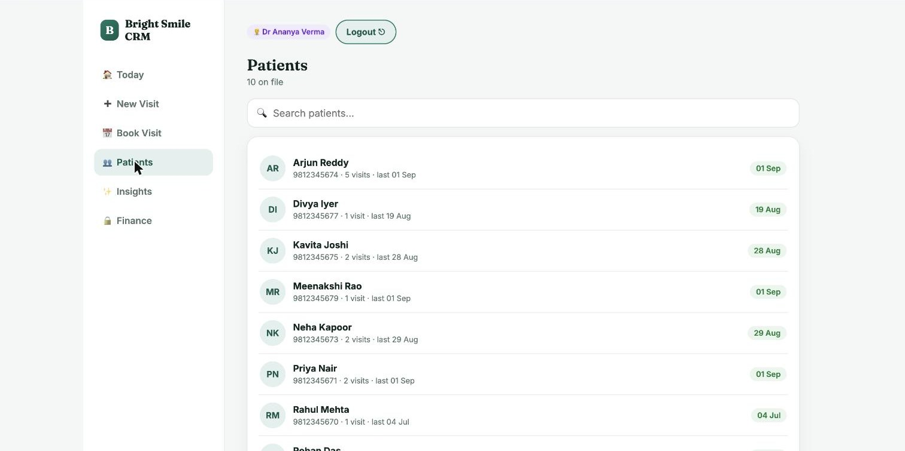

# Dental Clinic Management Software — Patients, Appointments & Billing on Google Workspace

A complete **dental practice management system** for a single clinic, running entirely
inside the clinic's own Google account. Patient records, appointments, treatment plans
and finances — with **no servers, no monthly SaaS fee, and no third party holding the
patient data.**

Built for a working dental clinic, used daily, then productized so it can be deployed
for a new practice in about a minute.

> **Showcase repository.** This documents what the system does and how it is built.
> The deployable source is private and licensed per practice —
> see [Working with me](#working-with-me).

---

## Who this is for

Single-location dental practices — and the clinics, chiropractors, physiotherapists,
salons and small medical practices with the same problem: practice management software
costs more per month than it saves, assumes a full-time receptionist, and stores patient
records on a vendor's servers.

This sits between paper and enterprise software. The clinic keeps its records in its own
Google account, staff use it from a phone, and it costs nothing to run.

---

## Frequently asked

**What does it cost to run?**
Nothing. It runs on Google Apps Script inside the clinic's existing Google account.
There is no hosting bill, no per-seat licence and no monthly SaaS subscription. The only
cost is the one-time setup.

**Where is the patient data stored?**
In the clinic's own Google Sheet, in the clinic's own Google account. No third-party
server holds it. If the clinic stops working with me, everything keeps running exactly
as it is — nothing is hosted on my side, so there is nothing I can switch off.

**Do staff need Google accounts?**
No. The app runs as the account that deployed it, so the doctor and assistant sign in
with a 4-digit PIN on a phone. They never need Google logins or access to the underlying
spreadsheet.

**Can the assistant see the money?**
No — and not as a UI setting that can be toggled. When an assistant signs in, the data
sent to their browser contains no financial fields at all. It is stripped on the server.

**Does it work outside India?**
Yes. Timezone, currency symbol and number formatting are set during setup, so it works
for a practice billing in ₹, $, £, AED or anything else.

**How long does deployment take?**
About a minute to stand up, then roughly ten minutes for the clinic to fill in the setup
screen. There is no data migration required to start — historical records can be pasted
into the sheet later.

**What happens to the data if we stop using it?**
It stays in the clinic's Google Sheet, readable and exportable forever. There is no
export process because the data never left.

---

## What it does

### For the dentist (admin)
- Record a visit in about thirty seconds, from the chair
- Full treatment history per patient, as a timeline
- **Multi-visit treatment plans with a running balance** — a root canal or crown course
  spans weeks and several part-payments; the system tracks the *course*, not just visits
- Month-by-month P&L: billed, collected, lab costs, expenses, net
- Outstanding patient balances, quotes that never converted, patients due for recall
- Visits where billing was forgotten, surfaced with a one-tap fix

### For the dental assistant / receptionist
- Register a patient and book them in
- Book follow-ups against the clinic's real Google Calendar
- Upload X-rays and intraoral photos straight to the clinic's Google Drive
- **Never sees a single financial figure**

### Built in
- WhatsApp appointment confirmation to the patient, in the clinic's own name
- Duplicate-patient detection that catches spelling variants — "Surbhi" vs "Surabhi"
- A guard against the same payment being recorded twice on one day

---

## Screenshots

### First-run setup

The screen a new clinic sees before anything else. It collects everything the app needs
— clinic name, brand colour, staff names, PINs, calendar, opening hours, timezone,
currency — and **refuses to complete while any shipped placeholder is still in place.**

That check exists because of a real incident. An earlier build made the clinic name
configurable, but nobody filled the cell in. The moment WhatsApp confirmations started
reading from config, patients would have received *"Your appointment at Clinic Galla is
confirmed."* Making a value configurable is only half the job; the other half is
refusing to run until it is set.

### The day screen

What the dentist sees on opening the app. Today's confirmed appointments, the money
recorded so far this month, patients with an outstanding balance, and visits still
waiting for an amount to be entered — one screen, no navigation. The figures are live
rollups from the same Sheet the clinic already keeps.

### Patient records

Every patient the clinic has ever seen, searchable by name or phone, with visit count
and last-visit date. Opening one gives the full treatment history, the running balance
on any multi-visit treatment plan, and the documents on file in Drive.

*Screenshots show a demo clinic with fabricated patient data.*

---

## How it is built

**Google Apps Script + one Google Sheet.** Two files: a server (`Code.gs`) and a
single-file client (`App.html`). No build step, no dependencies, no framework. What is in
the repository is exactly what runs.

**Every clinic gets its own deployment** — separate Sheet, separate script, separate
patients, separate money. Deliberately not multi-tenant, so one clinic's records cannot
leak into another's: they never share a database.

**Nothing clinic-specific lives in the code.** Clinic name, PINs, staff names, calendar,
hours, booking link, Drive folder, brand colour, timezone and currency are all rows in a
config tab. The code is byte-identical across every deployment, which is what makes one
bug fix pushable to all of them.

**The spreadsheet builds itself.** On first run the script creates its own sheets and
column headers, so a clinic is stood up from source alone — there is no template
spreadsheet to copy, and therefore no route by which one clinic's records could be
copied into another's.

### Decisions worth explaining

**Role separation is enforced on the server, not in the interface.** Hiding a column in
the UI is not a permission model. The assistant's payload simply does not contain money.

**A shared code library was considered and rejected.** It would let one change reach
every clinic instantly, but Apps Script requires each caller to have viewer access on the
library — and viewer means readable source. It also removes any way to stage a rollout,
so one bad save breaks every clinic at once. Per-clinic deployment with a scripted fleet
push was the better trade.

**Native dialogs turned out to be suppressed.** The duplicate-patient warning used
`confirm()`, which silently returns false inside the Apps Script iframe — so the "merge
with existing patient" branch had been unreachable in production, quietly creating the
duplicates it was written to prevent. Replaced with an inline panel. Every guard in the
app now uses DOM prompts.

---

## Testing

A read-only regression suite runs against a clinic's live data and writes nothing, so it
is safe to run during clinic hours. Two kinds of check:

- **Pure** — fixed inputs and outputs for the helpers: name normalisation, fuzzy
  matching, date formatting, currency.
- **Invariant** — facts that must hold for *any* correct data: every patient's paid total
  equals the sum of their rows, every treatment-plan balance equals billed minus paid,
  monthly net equals collected minus costs, and **the assistant payload contains no
  financial key.**

Invariant tests need no fixture data and get stronger as a clinic's records grow.
73 checks on a fresh install.

---

## Security

- PINs are compared server-side and never sent to the browser
- Eight wrong PINs in fifteen minutes freezes logins for ten minutes, with a deliberate
  delay on every wrong attempt
- The app runs as the deploying account, so staff never need Google accounts or access
  to the spreadsheet
- Known limitations are documented honestly for buyers rather than glossed over

---

## Working with me

I build small, durable business systems — the kind a two-person clinic actually uses
every day, rather than software that impresses in a demo and is abandoned in a month.

I can deploy this for your practice, or build something similar for another
single-location business.

- **Deployment for a dental practice**, including setup and staff handover
- **Custom builds on the same foundation** — clinics, salons, workshops, studios,
  any small business drowning in spreadsheets
- **Google Workspace automation** generally

The deployable source is private. I'm happy to walk through it on a call, or grant read
access to a serious prospect.

**Sumit Sagar** — [Upwork](https://upwork.com/freelancers/~010df4c2aeb616725e)

---

Keywords: dental clinic management software · dental practice management system ·
clinic CRM · patient management software for small clinics · dental appointment and
billing software · Google Apps Script business system · Google Sheets clinic management ·
practice management software without monthly fees

Copyright (c) 2026 Growth 100x. This showcase repository is documentation. The
software it describes is licensed per practice and is not open source.
